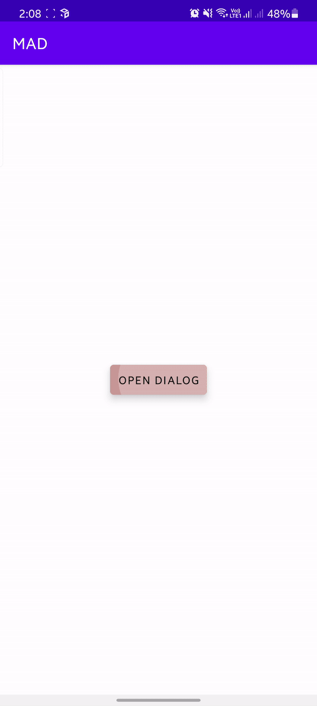

# MAD - Material Alert Dialog

## Description

**Alert dialogs** are one of the most crucial part of any application. It is the way we address the users and take their inputs. This project is equipped with a dialog which is specially build on **material guidlines**. 

## Requirements

 1. Enable Data Binding 
 2. Add material library dependency in app level ***build.gradle*** (comes pre-installed in latest version of android studio)  `implementation 'com.google.android.material:material:1.3.0'` 
 3. Add Lottie Animation Dependency - `implementation'com.airbnb.android:lottie:3.7.0'`

> Use this link to download multiple of free beautiful animations [https://lottiefiles.com/](https://lottiefiles.com/)

## Sample Video

